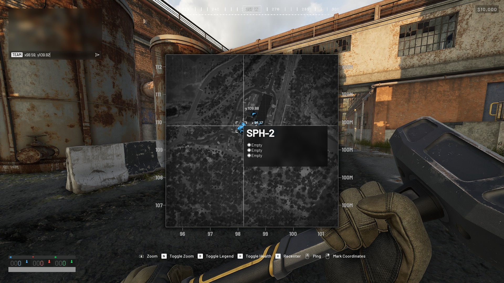
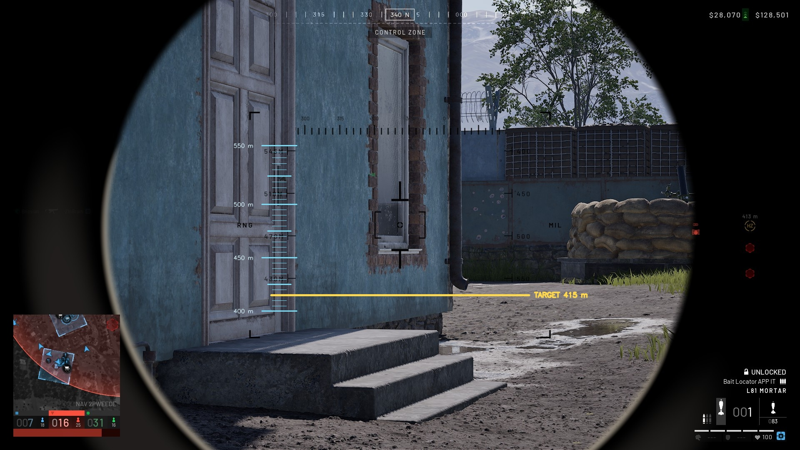

# War Dog Mortar Distance Calculator

This Windows utility automatically saves a visible TEAM mortar coordinate,
calculates the distance to the map coordinates under your mouse, and adds a
5-meter guide to the mortar scope. It does not click, press keys, read game
memory, or aim the mortar.

The screen regions and sight guide are calibrated for the 1920x1080 layout
shown in `206376~1.JPG` and `2067AB~1.JPG`. Coordinates may be anywhere on the
map. One coordinate unit is treated as 100 meters.




## Run it

1. Double-click `run_mortar_calculator.bat`.
2. Wait until the window says `Mortar calculator ready`.
3. Mark the mortar location in-game so a line such as
   `TEAM x98.59, y109.82` appears in the top-left.
4. The calculator watches while you are typing and automatically confirms
   `MORTAR SAVED`; you do not need to time F7 while the chat line is visible.
5. Open the map and point at the location you want to hit. Keep the pointer
   still so the map's `x##.##` and `y##.##` labels are visible.
6. Press **F8**.
7. Enter the mortar scope. The guide appears automatically and hides when you
   leave the scope.

A small overlay will show `RANGE ### m` for a few seconds. The console also
prints the mortar and target coordinates. You can press F8 for more targets;
if the mortar moves, press **F7 before marking it again** to re-arm automatic
TEAM-coordinate capture. Press **Ctrl+F8** to stop.

## Sight guide

- Small ticks mark every **5 m**.
- Longer ticks mark every **25 m**.
- Numbered ticks mark every **50 m**.
- The calculated target is rounded to the nearest 5 m and highlighted in
  yellow.
- The calibrated guide covers **400–550 m**. Ranges outside that window still
  appear numerically, but the calculator does not draw an untrusted target
  line.

The `206376~1.JPG` screenshot gives:

```text
Mortar: X=98.59, Y=109.82
Target: X=98.17, Y=109.88
Range: 42 m
```

## Manual setup

Python 3.12 or newer is recommended. From PowerShell in this folder:

```powershell
py -m venv .venv
.\.venv\Scripts\python.exe -m pip install -r requirements.txt
.\.venv\Scripts\python.exe mortar_calculator.py
```

## Check a saved screenshot

This mode is useful if live detection reports an error:

```powershell
.\.venv\Scripts\python.exe mortar_calculator.py `
  --image "206376~1.JPG" `
  --debug-output mortar_debug.jpg
```

The saved screenshot must show both the TEAM mortar line and the target X/Y
label. The debug image marks the two screen regions used for OCR.

## Troubleshooting

- **Could not read a TEAM mortar coordinate:** Create the TEAM coordinate line,
  and leave it visible briefly while typing. The watcher saves it automatically.
- **No mortar position is saved:** Wait for `MORTAR SAVED` before using F8.
- **The mortar moved:** Press F7 first, then mark the new coordinate; F7 clears
  the old position and re-arms the watcher.
- **Could not read target X/Y:** Keep the full map open and let both pointer
  coordinate labels appear before pressing F8.
- **Sight guide does not appear:** Calculate a target with F8 first, then enter
  the full mortar scope. The guide only supports the calibrated 1920x1080 UI.
- **Overlay is hidden behind the game:** Use borderless-windowed display mode.
  The calculated range is still printed in the console.
- **Different resolution or UI layout:** The OCR regions will need to be
  recalibrated.

## Tests

```powershell
.\.venv\Scripts\python.exe -m pytest -q
```
